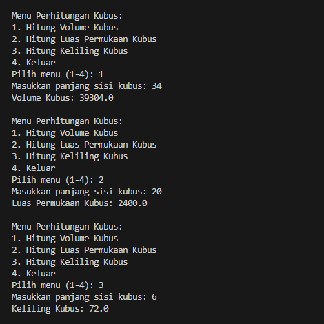

|  | Algoritma dan Struktur Data |
|--|--|
| Nama |  Sahrul Ramadhani|
| NIM |  244107020058|
| Kelas | TI - 1H |
---

# PRAKTIKUM JOBSHEET 1
---
## 1. Praktikum Pemilihan
Solusi di Implementasikan pada file nilaimutu.java, dan Berikut adalah ScreenShoot hasil menjalankan kodenya : 

#### Langkah Sederhana Program
1. Menginput Nilai Angka, yang Terdiri dari 4 nilai
2. Mengkalkulasi masing-masing nilai bedasarkan Bobot yang telah di tentukan agar menjadi nilai Akhir
3. Mengonversikan Nilai Akhir menjadi sebuah nilai Huruf
4. Menampilkan nilai Akhir dan Huruf
5. Menampilkan apakah Nilai Akhir tersebut termasuk dalam kategori nilai yang LULUS atau TIDAK LULUS
---
## 2. Praktikum Perulangan
Solusi di Implementasikan pada file cetakangka.java, dan Berikut adalah ScreenShoot hasil

#### Langkah Sederahana Program
1. Memasukan Input NIM
2. Mengambil 2 Digit terakhir untuk dijadikan N
3. Jika N <10 maka N+= 10
4. mencetak hasil angka 1 sampai N, Jika angkanya adalah 6 dan 10 maka angka tersebut di lewati
5. Jika angkanya adalah ganjil maka akan di cetak "*"
6. Jika angkanya adalah genab maka akan di cetak sesuai dengan nilai angka tersebut

---

## 3. Praktikum Array
Solusi di Implementasikan pada file ipk.java, dan Berikut adalah ScreenShoot hasil menjalankan codenya

#### Langkah Sederhana Program
1. Menginput Jumlah Matkul
2. Menginput Nama Matkul
3. Menginput Jumlah SKS
4. Menginput Nilai Angka
5. Mengulang sampai Jumlah Matkul yang ditentukan
6. Menampilkan Hasil Konversi Nilai
7. Menampilkan Hasil IPK

---

## 4. Praktikum Function
Solusi di Implementasikan pada file tokobunga.java, dan Berikut adalah ScreenShoot hasil menjalankan codenya

#### Langkah Sederhana Program
1. Menampilkan Menu dan Menentukan Menu yang ingin di pilih
2. Jika menu yang dipilih adalah 1 maka akan menampilkan Input untuk memilih Cabang 1-4 Untuk digunakan Mengetauhi Pendapatan setiap Toko Bunga Jika terjual Habis
3. Jika menu yang dipilih adalah 2 maka akan menampilkan Input untuk memilih Cabang 1-4 Untuk digunakan Mengetauhi Stok Bunga Setelah dilakukan Pengurangan Pada tiap Bunga yang Mati.
4. Jika menu yang dipilih adalah 3 maka akan Keluar dari Program.

---

## JAWABAN TUGAS

#### 1. Mencari Asal Kota Plat Nomor dari Karakter. 
Solusi di implementasikan pada file platnomor.java, Berikut adalah hasil Screenshoot Menjalankan Program Tersebut

##### Langkah Sederhana Program
1. Menginput Kode Plat Nomor
2. Sistem melakukan Pencarian pada data Array yang telah dibuat
3. Output nya Adalah Kota Asal Plat Nomor yang sesuai dengan Kode yang diinputkan.

#### 2. Mencari beberapa Rumus Kubus
Solusi di implementasikan pada file kubus.java, Berikut adalah hasil Screenshoot Menjalankan Program Tersebut

##### Langkah Sederhana Program
1. Sistem Menampilkan Menu program yang harus dipilih oleh Pengguna
2. Pengguna Memasukan Input Panjang sisi untuk mencari hasil dari beberapa Rumus Kubus yang telah dibuat
3. Sistem Mengkalkulasi input User dengan Rumus yang sudah dibuat di dalam masing masing Function
4. Output dari Hasil Perhitungan akan ditampilkan kepada Pengguna.

#### 3. Program Jadwal Kuliah
Solusi di implementasikan pada file matkul.java, Berikut adalah hasil Screenshoot Menjalankan Program Tersebut

##### Langkah Sederhana Program
1. Pengguna Menginputkan Data Matakuliah sesuai yang di tentukan.
2. Program tersebut bisa di jalankan dengan beberapa menu untuk menampilkan matakuliah yang ingin di tampilkan seperti bedasarkan Hari, semester ke berapa atau menampilkan semua matakuliah yang telah diinputkan.