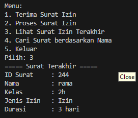

|  | Algoritma dan Struktur Data |
|--|--|
| Nama |  Sahrul Ramadhani|
| NIM |  244107020058|
| Kelas | TI - 1H |

# PRAKTIKUM JOBSHEET 10

### Percobaan 1: Mahasiswa Mengumpulkan Tugas
Hasil Source code dari percobaan 1 telah saya lampirkan pada folder Jobsheet10/SC yang terdiri dari 4 File Java, dan berikut  ini adalah Hasil Outputya :


### Berikut adalah jawaban dari Soal Percobaan 1 :
1.  memodify method print 
```java
public void print() {
    if (isEmpty()) {
        System.out.println("Belum ada tugas yang dikumpulkan.");
        return;
    }
    System.out.println("Nama\t\tNIM\t\tKelas\tNilai");
    for (int i = top; i >= 0; i--) {
        String nilaiStr = (stack[i].nilai == -1) ? "Belum Dinilai" : String.valueOf(stack[i].nilai);
        System.out.println(stack[i].nama + "\t" + stack[i].nim + "\t" + stack[i].kelas + "\t" + nilaiStr);
    }
    System.out.println();
}
```
Output : 


2. maksimal data adalah 5
```java
StackTugasMahasiswa24 stack = new StackTugasMahasiswa24(5);
```

3. Untuk menghindari penambahan elemen ketika stack sudah penuh. Jika isFull() dihapus dan push tetap menambahkan data, maka akan terjadi 
```java
ArrayIndexOutOfBoundsException
```

4. Tambahkan method di StackTugasMahasiswa24:
``` java
public Mahasiswa24 bottom() {
    if (!isEmpty()) {
        return stack[0];
    } else {
        System.out.println("Stack masih kosong!");
        return null;
    }
}
```

Modifikasi di MahasiswaDemo24, tambahkan menu:
```java
System.out.println("5. Melihat Tugas Pertama");
```

Tambahkan case:
``` java
case 5:
    Mahasiswa24 terbawah = stack.bottom();
    if (terbawah != null) {
        System.out.println("Tugas pertama dikumpulkan oleh " + terbawah.nama);
    }
    break;
```
Output :


5. Tambahkan di StackTugasMahasiswa24:
```java
public int jumlahTugas() {
    return top + 1;
}

Modifikasi di MahasiswaDemo24, tambahkan menu:
System.out.println("6. Lihat Jumlah Tugas Terkumpul");
```

Tambahkan case:
```java
case 6:
    System.out.println("Jumlah tugas yang sudah dikumpulkan: " + stack.jumlahTugas());
    break;
```
Output :


## percobaan 2
Hasil Source code dari percobaan 2 telah saya lampirkan pada folder Jobsheet10/SC yang terdiri dari 4 File Java, sama seperti percobaan 1 hanya saja saya menambahkan method untuk menkonversikan bilangan Nilai menjadi sebuah Biner pada file StackKonversi24.java dan modify beberapa kode pada Main function dan berikut  ini adalah Hasil Outputya :


1. Saya akan menjelaskan Secara kompleks dengan kodenya agar lebih jelas.
``` java 
while (nilai > 0) { // Selama nilai > 0
        int sisa = nilai % 2; // Ambil sisa bagi 2 (0 atau 1)
        stack.push(sisa);     // Simpan ke dalam stack
        nilai = nilai / 2;    // Bagi nilai dengan 2
    }

    String biner = "";
    while (!stack.isEmpty()) { // Ambil dari stack dan gabungkan
        biner += stack.pop();
    }
    // Contoh:
    //Misal nilai = 10
    //Proses stack akan menyimpan: 0, 1, 0, 1 (dari bawah ke atas)
    //Setelah dibalik: 1010
```
2. Jika kode di ubah menjadi while (Nilai != 0) tidak akan terjadi perubahan signifikan dari kode sebelumnya (Nilai >0) dikarenakan arti  dari kode tsbt adalah nilai yang dimasukan tidak boleh angka 0, namun jika pengguna memasukan nilai negatif akan terjadi perulangan while secara infinite loop.


## Latihan Praktikum
Hasil Source code dari Latihan Praktikum telah saya lampirkan pada folder SC/SuratDemo24 yang terdiri dari beberapa class yang saya jadikan 1 dalam 1 file, dan berikut  ini adalah Hasil Outputya :




ALUR KERJA KODE:
1. Class Surat24
Merupakan representasi data surat izin.
Menyimpan:
idSurat: ID surat
namaMahasiswa: Nama pengirim
kelas: Kelas mahasiswa
jenisIzin: 'S' (sakit) atau 'I' (izin)
durasi: Lama izin (hari)

2. Class StackSurat
Mengelola array Surat24 seperti stack (LIFO: Last In, First Out).
Fitur:
push(Surat24): Menambahkan surat ke stack.
pop(): Menghapus dan memproses surat paling atas.
peek(): Melihat surat paling atas tanpa menghapus.
cariSurat(nama): Mencari surat berdasarkan nama mahasiswa.

3. Class SuratDemo24 (Main)
Menyediakan menu interaktif:
    1. Terima Surat Izin – input data surat dan simpan ke stack.
    2. Proses Surat Izin – menghapus surat paling atas dari stack.
    3. Lihat Surat Izin Terakhir – menampilkan surat paling atas.
    4. Cari Surat berdasarkan Nama – cari dan tampilkan surat berdasarkan nama.
    5. Keluar – menghentikan program.