 |  | Algoritma dan Struktur Data |
|--|--|
| Nama |  Sahrul Ramadhani|
| NIM |  244107020058|
| Kelas | TI - 1H |

# PRAKTIKUM JOBSHEET 11

## Percobaan 1: Operasi Dasar Queue
Hasil Source code dari percobaan 1 telah saya lampirkan pada folder Jobsheet11/SC yang terdiri dari 2 File Java yang bernama Queue24.java dan QueueMain24.java berikut  ini adalah Hasil Outputya :
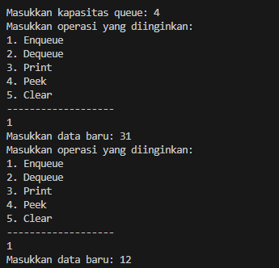
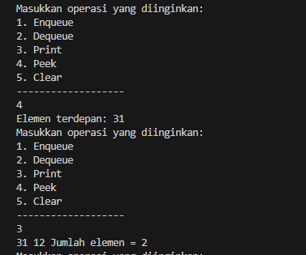
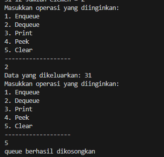

### Alur Kerja Kode
1. Pengguna memasukkan kapasitas queue.
2. Queue dibuat dengan front = -1, rear = -1, dan size = 0.
3. Menampilkan Menu:
4. Program menampilkan pilihan operasi: Enqueue, Dequeue, Print, Peek, Clear.
5. Operasi Queue:
    Enqueue: Tambahkan data baru di rear (sirkuler).
    Dequeue: Hapus data di front (sirkuler).
    Print: Tampilkan semua elemen dari front hingga rear.
    Peek: Tampilkan elemen front.
    Clear: Kosongkan queue.
6. Pengulangan Menu:
    Menu terus berulang hingga pengguna memilih 0 untuk keluar.

### Berikut adalah jawaban dari Soal Percobaan 1 :
1. Front dan rear di inisialisasi -1 untuk tanda bahwa queue masih kosong dan belum ada elemen yang masuk, sedagkan size 0 adalah tanda bahwa tidak ada elemen yang di tambahkan ke dalam queue
2. Jika rear sudah indeks terakhir (max - 1), maka rear direset 0 agar penambahan elemen dilakukan di awal array.
3. Jika front sudah mencapai indeks terakhir (max - 1), maka front direset menjadi 0 untuk menghapus elemen awal array.
4. karena iterasi dimulai dari front agar elemen dapat ditampilkan secara berurutan sesuai urutan masuknya.
5. Jika i sudah mencapai indeks terakhir (max - 1), maka (i + 1) % max akan menghasilkan 0, sehingga iterasi dapat dilanjutkan dari awal array.
6. Jika size == max,penuh (overflow) dan elemen baru tidak dapat ditambahkan.
7. Untuk menghentikan program saat terjadi overflow atau underflow, kita tambahkan System.exit(0) pada kondisi tersebut di case enqueue dan dequeue. 
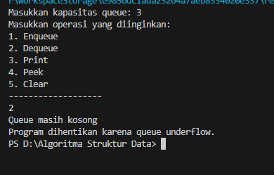


## Percobaan 2: Antrian Layanan Akademik
Hasil Source code dari percobaan 2 telah saya lampirkan pada folder Jobsheet11/SC yang terdiri dari 3 File Java yang bernama Mahasiswa.java, AntrianLayanan24.java dan LayananAkademikSIAKAD24.java berikut  ini adalah Hasil Outputya :
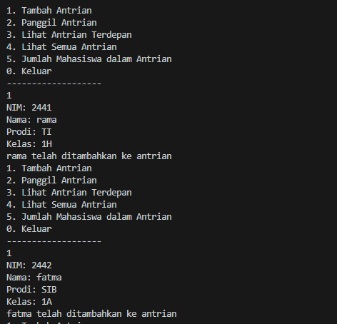
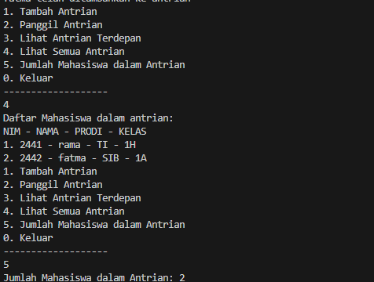

### Alur Sederhana Program :
1. Inisialisasi: Buat antrian (AntrianLayanan24) untuk menyimpan objek Mahasiswa24.
2. Menu: Pilih opsi (Tambah Antrian, Panggil Antrian, Lihat Terdepan, Lihat Semua, Jumlah, Lihat Belakang, Keluar).
3. Proses: Sesuai pilihan, tambah mahasiswa (enqueue), panggil (dequeue), lihat depan (peek), lihat belakang (lihatAkhir), atau tampilkan semua.
4. Keluar: Program berhenti saat pilih 0.

### Berikut adalah jawaban dari Soal Percobaan 2 :
1. Modify Kode menambahkan menu baru :
Tambahkan Case baru lihatAkhir:
``` java
 case 6:
                    antrian.lihatAkhir();
                    break;
```
Tambahkan Method baru 
``` java

        public void lihatAkhir() {
           if (isEmpty()) {
               System.out.println("Antrian Kosong");
            } else {
               System.out.println("Mahasiswa paling belakang:");
              data[rear].tampilkanData();
            }
        }
```

Output :
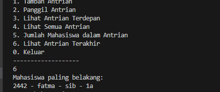


## Latihan Praktikum
Hasil Source code dari percobaan 1 telah saya lampirkan pada folder Jobsheet11/SC/Praktikum yang terdiri dari 3 File Java dan berikut ini adalah Hasil Outputya :

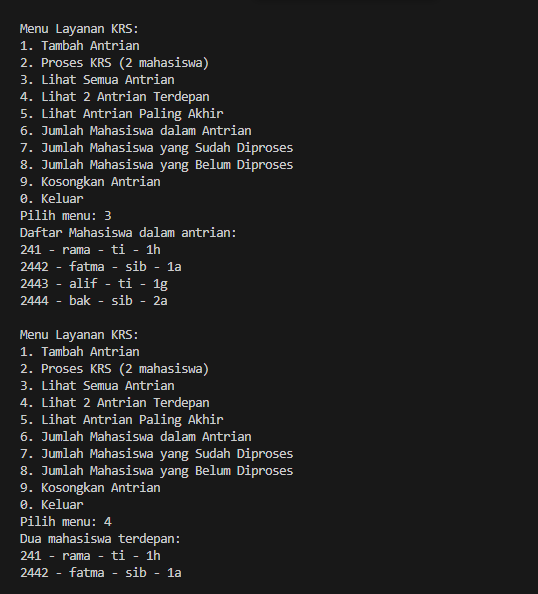
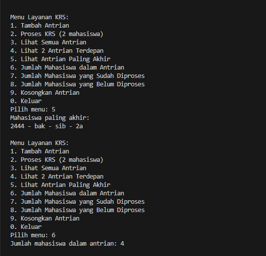
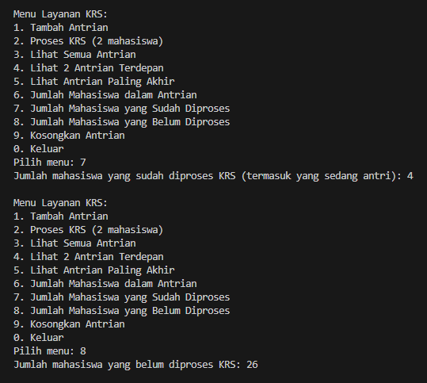
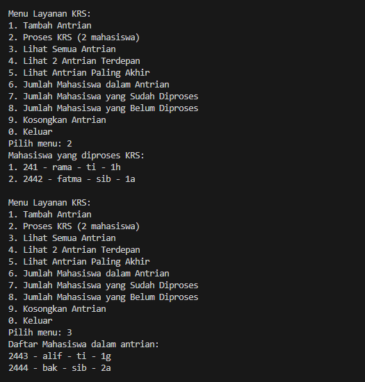
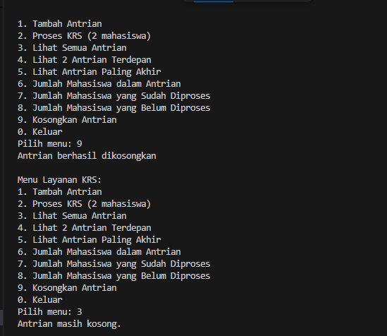

#### Alur Singkat Program :
1. Inisialisasi:
    - Program meminta pengguna memasukkan kapasitas maksimum antrian (maksimal 10 mahasiswa).
    - Membuat objek QueueKRS untuk mengelola antrian mahasiswa.

2. Menu Utama:
    - Pengguna diberikan pilihan menu untuk melakukan berbagai operasi seperti menambah antrian, memproses KRS, melihat antrian, dll.

3. Operasi Antrian:
    - Tambah Antrian: Pengguna memasukkan data mahasiswa (NIM, Nama, Prodi, Kelas) yang akan ditambahkan ke antrian.
    - Proses KRS: Dua mahasiswa terdepan diproses dan dikeluarkan dari antrian. Jika kurang dari 2 mahasiswa, proses tidak dilakukan.
    - Lihat Semua Antrian: Menampilkan seluruh mahasiswa yang sedang mengantri.
    - Lihat 2 Antrian Terdepan: Menampilkan dua mahasiswa terdepan dalam antrian.
    - Lihat Antrian Paling Akhir: Menampilkan mahasiswa yang berada di posisi paling belakang.
    - Jumlah Mahasiswa dalam Antrian: Menampilkan jumlah mahasiswa yang masih berada di antrian.
    - Jumlah Mahasiswa yang Sudah Diproses: Menampilkan jumlah mahasiswa yang telah diproses, termasuk yang sedang mengantri.
    - Jumlah Mahasiswa yang Belum Diproses: Menampilkan sisa mahasiswa yang belum diproses dari total kapasitas 30 mahasiswa.
    - Kosongkan Antrian: Menghapus semua data antrian dan mengatur ulang posisi antrian.
    - Program akan terus berjalan hingga pengguna memilih menu 0 (Keluar).