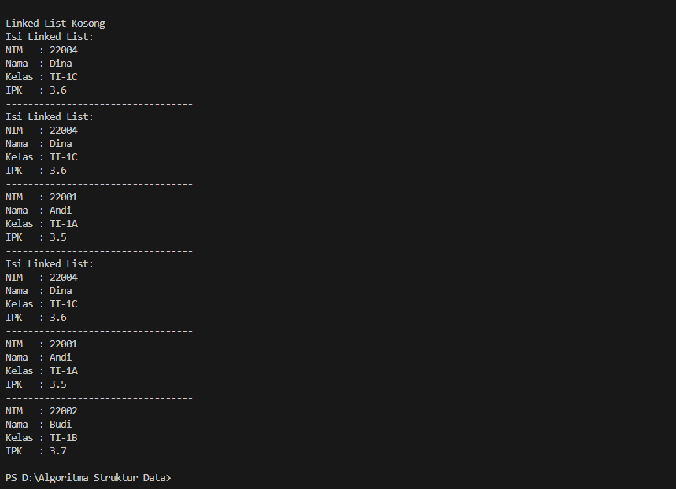
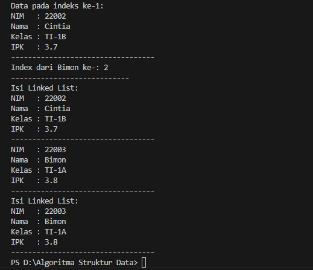
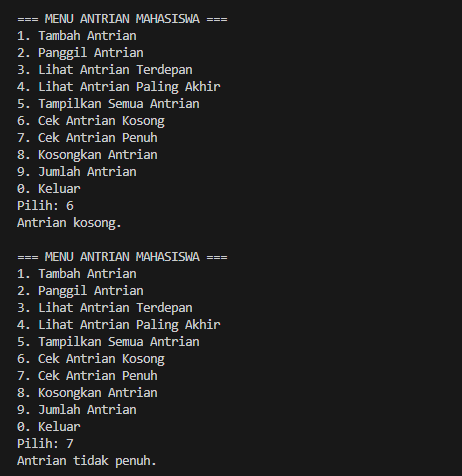
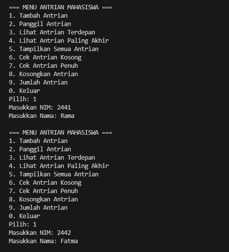
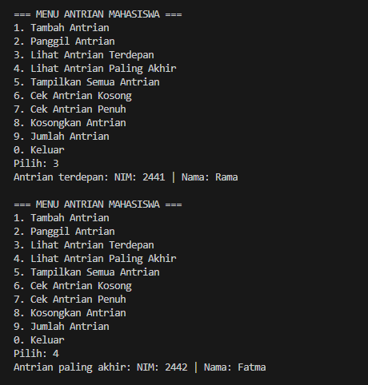
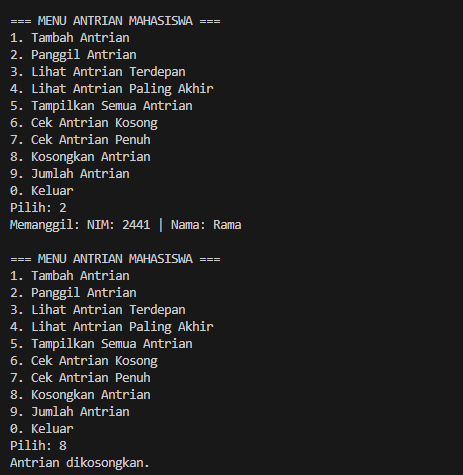
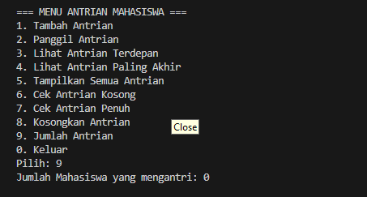

 |  | Algoritma dan Struktur Data |
|--|--|
| Nama |  Sahrul Ramadhani|
| NIM |  244107020058|
| Kelas | TI - 1H |

# PRAKTIKUM JOBSHEET PERTEMUAN 12

## Percobaan 1: Pembuatan Single Linked List
Hasil Source code dari percobaan 1 telah saya lampirkan pada folder Jobsheet12/SC yang terdiri dari 4 File Java yang bernama Mahasiswa24.java, Node24.java, QueueLinkedList24.java dan QueueMain24.java berikut  ini adalah Hasil Outputya :


## Pertanyaan Percobaan 1
1. Karena pada saat baris data.print(); pertama kali dijalankan, belum ada node yang ditambahkan ke linked list
2. Variabel temp digunakan sebagai penunjuk node sementara dalam proses traversal (penelusuran) linked list.
3. Modify Kode
``` java

import java.util.Scanner;

public class SLLMain24 {
    public static void main(String[] args) {
        Scanner sc = new Scanner(System.in);
        SingleLinkedList24 data = new SingleLinkedList24();

        System.out.print("Masukkan jumlah mahasiswa: ");
        int jumlah = sc.nextInt();

        for (int i = 1; i <= jumlah; i++) {
            System.out.println("Masukkan data Mahasiswa ke-" + i);
            System.out.print("NIM   : ");
            String nim = sc.nextLine();
            System.out.print("Nama  : ");
            String nama = sc.nextLine();
            System.out.print("Kelas : ");
            String kelas = sc.nextLine();
            System.out.print("IPK   : ");
            double ipk = sc.nextDouble(); sc.nextLine();

            Mahasiswa24 mhs = new Mahasiswa24(nim, nama, kelas, ipk);
            data.addLast(mhs);
            data.print();
        }
    }
}

```
## Percobaan 2: Modifikasi Elemen pada Single Linked List
Hasil Source code dari percobaan 2 tidak jauh beda dengan Percobaan 1 hanya saja menambahkan beberapa fitur sesuai intruksi yang ada pada Jobsheet dan telah saya lampirkan pada folder Jobsheet12/SC yang terdiri dari 4 File Java yang bernama Mahasiswa24.java, Node24.java, QueueLinkedList24.java dan QueueMain24.java berikut  ini adalah Hasil Outputya :


## Jawaban Pertanyaan Percobaan 2
1. break digunakan untuk menghentikan proses pencarian ketika node yang mengandung data yang dicari (misalnya Nama) telah ditemukan dan dihapus. Tanpa break, perulangan akan terus berjalan meskipun data sudah ditemukan
2. untuk memperbarui pointer tail jika node yang dihapus adalah node terakhir. Jika tidak diperbarui, maka tail akan tetap menunjuk ke node yang sudah tidak ada dalam linked list, sehingga akan eror pada operasi berikutnya

## PRAKTIKUM
Buatlah implementasi program antrian layanan unit kemahasiswaan sesuai dengan berikut ini :
1. Implementasi antrian menggunakan Queue berbasis Linked List!
2. Program merupakan proyek baru bukan modifikasi dari percobaan
3. Ketika seorang mahasiswa akan mengantri, maka dia harus mendaftarkan datanya
4. Cek antrian kosong, Cek antrian penuh, Mengosongkan antrian.
5. Menambahkan antrian
6. Memanggil antrian
7. Menampilkan antrian terdepan dan antrian paling akhir
8. Menampilkan jumlah mahasiswa yang masih mengantre.

Hasil Source Code telah saya Kerjakan dan dapat dilihat pada Folder Soal Praktikum yang terdiri dari beberapa file java dan berikut ini adalah hasil source code nya:







