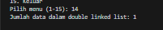

 |  | Algoritma dan Struktur Data |
|--|--|
| Nama |  Sahrul Ramadhani|
| NIM |  244107020058|
| Kelas | TI - 1H |

# PRAKTIKUM JOBSHEET 13 DOUBLE LINKED LIST

## PERCOBAAN 1
Hasil Source code dari percobaan 1 telah saya lampirkan pada folder Jobsheet13/SC yang terdiri dari 4 File Java yang berada pada folder SC berikut  ini adalah Hasil Outputya :

## Jawaban Soal Percobaan 1
1. pada singel linked list,node nya hanya mempunyai 1 pointer/1 tangan saja, data dari node 1 hanya menunjuk ke node berikutnya. Sedangkan double linked list mempunyai 2 pointer/ 2 tangan. Dari node 1 bisa menunjuk setelahn node 1 dan sebelum node 1. 
2. - Next digunakan untuk menunjuk pada node berikutnya 
   - Prev digunakan untuk menunjuk pada node sebelumnya
3. untuk menginisialisasi objek DoubleLinkedLists saat pertama kali dibuat. Dan menyatakan bahwa daftar node  masih kosong, karena head dan tail merujuk ke null.
4. jika double linked list masih kosong, dan baru ada node pertama yang ditambahkan, maka otomatis node pertama itu menjadi kepala dan buntut sekaligus karena hanya ada 1 node yang menjadi awal dan akhir. 
5. Setelah menambahkan newNode di depan head lama, maka node lama sekarang memiliki prev yang menunjuk ke newNode, jadi node yang baru ditambahkan akan menjadi head yang baru. 
6. Kode Sudah saya modify pada method Print dengan Hasil Output Berikut :

7. untuk mengatur prev dari node yang dulunya berada setelah temp agar sekarang menunjuk ke newNode.
8. Kode sudah saya Modify pada Case 3 di Main dengan Hasil Output Berikut

## PERCOBAAN 2
Hasil Source code dari percobaan 1 adalah Hasil dari Modify dari kode Percobaan 1 dan telah saya lampirkan pada folder Jobsheet13/SC yang terdiri dari 4 File Java yang berada pada folder SC berikut  ini adalah Hasil Outputya :

## Jawaban Soal Percobaan 2
1. head next untuk memindahkan pointer head ke node berikutnya, head prev untuk menghapus pointer dari node baru ke node lama yang dihapus. 
2. Kode Telah saya modify pada Remmove First dan Remove Last dengan Hasil Output Berikut :

## TUGAS PRAKTIKUM
1. Tambahkan fungsi add() pada kelas DoubleLinkedList untuk menambahkan node pada indeks tertentu

2. Tambahkan removeAfter() pada kelas DoubleLinkedList untuk menghapus node setelah data key.

3. Tambahkan fungsi remove() pada kelas DoubleLinkedList untuk menghapus node pada indeks tertentu.

4. Tambahkan fungsi getFirst(), getLast() dan getIndex() untuk menampilkan data pada node head, node tail dan node pada indeks tertentu.

5. tambahkan kode program dan fungsi agar dapat membaca size/ jumlah data pada Double Linked List

