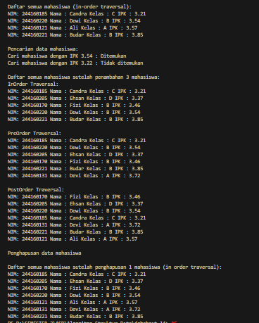
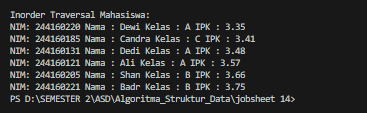
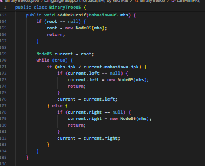
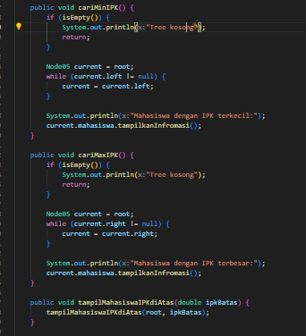
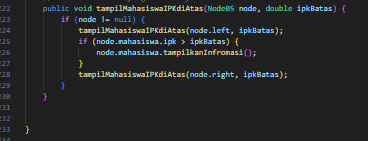
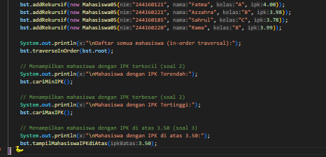
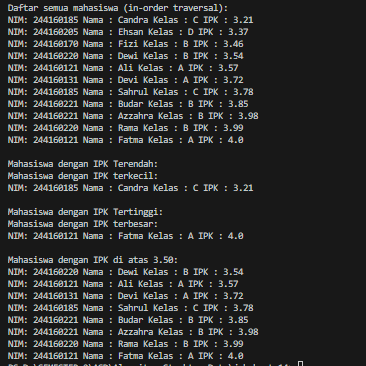
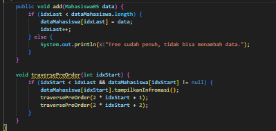
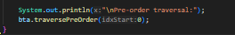
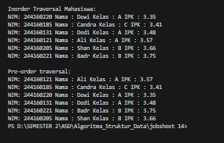

|  | Algoritma dan Struktur Data |
|--|--|
| Nama |  Sahrul Ramadhani|
| NIM |  244107020058|
| Kelas | TI - 1H |

# PRAKTIKUM JOBSHEET 13 DOUBLE LINKED LIST

## PERCOBAAN 1
Hasil Source code dari percobaan 1 telah saya lampirkan pada folder Jobsheet14/SC yang terdiri dari bebeberapa File Java yang berada pada folder SC berikut  ini adalah Hasil Outputya :

## JAWABAN SOAL PERCOBAAN 1
1.	Mengapa dalam binary search tree proses pencarian data bisa lebih efektif dilakukan dibanding  binary tree biasa? 
Jawaban : karena nilai disebelah kiri node lebih kecil dan sebelah kanan lebih besar. Jadi, tidak perlu mengecek semua node, cukup mengikuti arah sesuai nilai yang dicari, sehingga lebih cepat dibanding binary tree biasa yang tidak beraturan.
2.	Untuk apakah di class Node, kegunaan dari atribut left dan right? 
Jawaban : atribut left dan right berfungsi untuk menunjuk ke anak kiri dan anak kanan dari sebuah node. Dengan dua atribut ini, tree bisa bercabang dan membentuk struktur pohon.
3.	a) Untuk apakah kegunaan dari atribut root di dalam class BinaryTree?  
Jawaban : root berfungsi sebagai titik awal atau akar dari tree. Semua proses seperti menambah, mencari, atau menampilkan data dimulai dari root.

    b) Ketika objek tree pertama kali dibuat, apakah nilai dari root? 
Jawaban :jika tree masih kosong dan menambahkan node pertama kali, maka node itu otomatis jadi root

4.	Ketika tree masih kosong, dan akan ditambahkan sebuah node baru, proses apa yang akan terjadi? 
Jawaban :  proses yang terjadi dimulai dari pengecekan apakah root masih bernilai null. Jika iya, maka node baru tersebut akan langsung dibuat dan ditempatkan sebagai root. Proses ini disebut inisialisasi tree, di mana node pertama menjadi titik awal atau akar dari pohon. 
5.	Perhatikan method add(), di dalamnya terdapat baris program seperti di bawah ini. Jelaskan secara detil untuk apa baris program tersebut? 
Jawaban : 
Baris program tersebut digunakan untuk menentukan posisi penempatan node baru dalam tree berdasarkan nilai IPK. Pertama, node parent menyimpan posisi node current saat ini sebagai calon induk. Lalu dilakukan perbandingan antara IPK mahasiswa baru dengan IPK pada node current. Jika IPK mahasiswa baru lebih kecil, maka pencarian dilanjutkan ke anak kiri (current.left), dan jika kosong, node baru ditempatkan di kiri parent. Sebaliknya, jika IPK lebih besar atau sama, pencarian bergerak ke kanan (current.right), dan jika kosong, node baru ditempatkan di kanan parent. Logika ini memastikan pohon tetap mengikuti aturan binary search tree, di mana node kiri lebih kecil dan node kanan lebih besar.
6.	Jelaskan langkah-langkah pada method delete() saat menghapus sebuah node yang memiliki dua anak. Bagaimana method getSuccessor() membantu dalam proses ini?
Jawaban : 
	Ketika menghapus node yang memiliki dua anak, langkah pertama adalah mencari successor atau pengganti node tersebut, yaitu node dengan nilai terkecil di subtree kanan. Method getSuccessor() digunakan untuk menemukan node ini. Setelah ditemukan, data dari successor disalin ke node yang akan dihapus. Kemudian, successor yang posisinya pasti hanya memiliki maksimal satu anak (karena merupakan node terkiri) dihapus menggunakan logika penghapusan node dengan nol atau satu anak. Dengan cara ini, struktur dan aturan binary search tree tetap terjaga, dan proses penghapusan node dengan dua anak bisa dilakukan dengan aman dan efisien.

## PERCOBAAN 2
Hasil Source code dari percobaan 2 adalah Hasil dari Modify dari kode Percobaan 2 dan telah saya lampirkan pada folder Jobsheet14/SC yang terdiri dari beberapa File Java yang berada pada folder SC berikut  ini adalah Hasil Outputya :

## JAWABAN SOAL PERCOBAAN 2'

1.	Apakah kegunaan dari atribut data dan idxLast yang ada di class BinaryTreeArray? 
Jawaban :  Atribut dataMahasiswa berfungsi menyimpan data seluruh node dalam bentuk array. Sedangkan idxLast digunakan untuk menunjukkan indeks terakhir yang berisi data dalam array, agar traversal atau pengolahan data tidak melebihi batas.
2.	Apakah kegunaan dari method populateData()? 
Jawaban : digunakan untuk mengisi array dataMahasiswa dengan data dari luar dan mengatur nilai akhir indeks (idxLast) sesuai jumlah data yang dimasukkan
3.	Apakah kegunaan dari method traverseInOrder()? 
Jawaban : Method ini digunakan untuk menampilkan isi tree dengan cara inorder traversal, yaitu mengunjungi node kiri → node saat ini → node kanan, mengikuti struktur pohon biner.
4.	Jika suatu node binary tree disimpan dalam array indeks 2, maka di indeks berapakah posisi  left child dan rigth child masing-masing? 
Jawaban : Jika node berada di indeks 2, maka:
    •	Left child-nya ada di indeks 2 * 2 + 1 = 5
    •	Right child-nya ada di indeks 2 * 2 + 2 = 6

5.	Apa kegunaan statement int idxLast = 6 pada praktikum 2 percobaan nomor 4? 
Jawaban : membantu program agar tidak memproses indeks yang kosong saat traversal.
6.	Mengapa indeks 2*idxStart+1 dan 2*idxStart+2 digunakan dalam pemanggilan  rekursif, dan apa kaitannya dengan struktur pohon biner yang disusun dalam array?
Jawaban : Karena dalam representasi binary tree berbasis array, untuk node di indeks i, anak kirinya berada di indeks 2i + 1 dan anak kanannya di 2i + 2. Rumus ini mencerminkan struktur pohon secara logis dalam bentuk array.

## TUGAS 
1. Buat method di dalam class BinaryTree00 yang akan menambahkan node dengan cara
rekursif (addRekursif()).

2. Buat method di dalam class BinaryTree00 untuk menampilkan data mahasiswa dengan IPK
paling kecil dan IPK yang paling besar (cariMinIPK() dan cariMaxIPK()) yang ada di dalam
binary search tree.

3. Buat method dalam class BinaryTree00 untuk menampilkan data mahasiswa dengan IPK di
atas suatu batas tertentu, misal di atas 3.50 (tampilMahasiswaIPKdiAtas(double ipkBatas))
yang ada di dalam binary search tree.

4. Modifikasi class BinaryTreeArray00 di atas, dan tambahkan :
• method add(Mahasiswa data) untuk memasukan data ke dalam binary tree
• method traversePreOrder()

