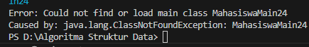
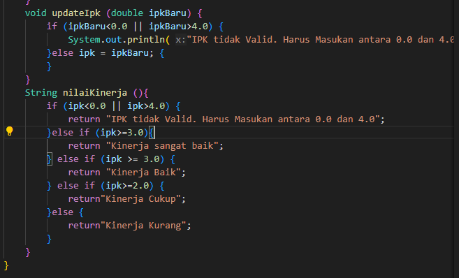
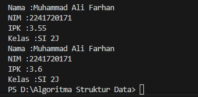
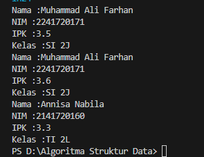
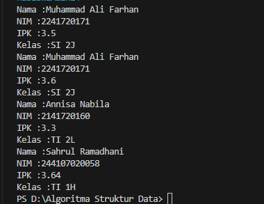
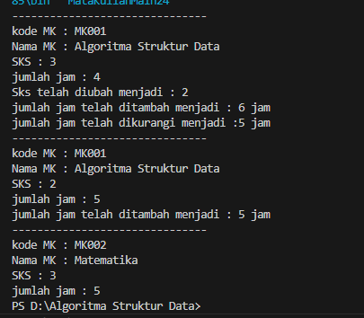
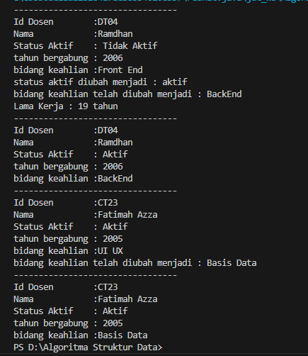

|  | Algoritma dan Struktur Data |
|--|--|
| Nama |  Sahrul Ramadhani|
| NIM |  244107020058|
| Kelas | TI - 1H |

# PRAKTIKUM JOBSHEET 2

### Percobaan 1
Kode Program seperti Jobsheet di implementasikan pada file Mahasiswa24.java
dan berikut adalah hasil compilenya :

### Jawaban Percobaan 1

1. ada 2 karakteristik dari objek, yaitu atribut dan method.
Atribut adalah sesuatu yang melekat pada suatu objek, atribut biasanya menetukan sifat 
dari objeknya. Sedangkan method adalah aksi yang bisa dilakukan suatu objek.
2. 4 atribut, ada Nama, NIM, kelass, dan IPK.
3. 4 method, yaitu tampilkan informasi, ubah kelas, update ipk, nilai kinerja.
4. Berikut adalah modify codenya :

5. Cara kerjanya adalah menentukan output return yang keluar
- jika ipk <0.0 || ipk >4.0 return "Ipk tidak Valid"
- jika ipk >= 3.5 return “kinerja sangat baik”. 
- jika ipk >= 3.0 return “kinerja baik”.
- jika ipk >= 2.0 return “kinerja cukup”.
- jika ipk < 2.0 return “kinerja kurang”

### Percobaan 2

Kode Program seperti Jobsheet di implementasikan pada file MahasiswaMain24.java
dan berikut adalah hasil compilenya :

### Jawaban Percobaan 2
1. Mahasiswa05 mhs1 = new Mahasiswa05(); adalah proses instansiasi, nama objek yang dihasilkan adalah mhs1.
2. membuat class dahulu, kemudian instantsiasi obje dari class tersebut. Contoh :
Mahasiswa24 mhs1 = new Mahasiswa24(); mengambil atribut dan method dari class Mahasiswa24 untuk mhs1.
3. Karena Perubahan pada ubahKelas dan updateIpk, setelah perubahan tersebut maka ketika di tampilkan juga ikut berubah nilainya.

### Percobaan 3

Kode Program seperti Jobsheet di implementasikan pada file Mahasiswa24.java yang sedikit di modifikasi
dan berikut adalah hasil compilenya :

### Jawaban Percobaan 3
1. kode yang digunakan untuk mendeklaraasikan konstruktor berparameter adalah  Mahasiswa24 mhs2 = new Mahasiswa24
2. Mendeklarasikan Konstruktor beserta parameter didalamnya.
3. EROR karena tidak ada parameternya.
4. method didalam class mahasiswa tidak harus diakses secara berurutan karena method bersifat mandiri dan tidak bergantung pada urutan pemanggilnya. Namun, jika ada method yang bergantung pada hasil dari method lain, maka perlu diperhatikan urutannya.
5. Object baru telah dibuat di dalam file mahasiswa24.java dengan hasil compile nya:

### JAWABAN TUGAS
1. solusi kode program pada tugas pertama saya tulis pada folder mata kuliah dalam file mataKuliah24.java dan main funtionnya pada file MataKuliahMain24.java dengan Hasil Compile sebagai berikut:

2. solusi permasalahan pada tugas nomor dua telah saya tulis pada folder Mata Kuliah dalam file dosen24.java  dan main funtionnya pada file dosenmain24.java dengan hasil compile sebagai berikut ini :
    

