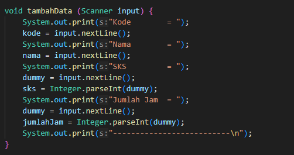
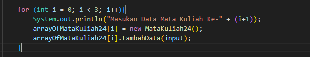
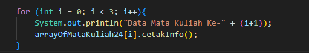

|  | Algoritma dan Struktur Data |
|--|--|
| Nama |  Sahrul Ramadhani|
| NIM |  244107020058|
| Kelas | TI - 1H |

# PRAKTIKUM JOBSHEET 3

### Percobaan 1
Kode Program seperti Jobsheet di implementasikan pada file MahasiswaDemo24.java pada folder Jobsheet3/Mahasiswa/
dan berikut adalah hasil compilenya :

Langkah Program sederhanya adalah membuat array of object.

### Jawaban Percobaan 1
1. TIDAK, Sebuah class dalam Java dapat dibuat dengan hanya atribut (data structure) atau hanya metode (utility class), tergantung pada tujuannya.
2. Untuk menginstansiasi atau inialisasi Array pada class Mahasiswa dengan panjang 3
3. Karena JAVA otomatis membuat konstruktor default.
4. Untuk mengisi Input pada VAR nim, nama, kelas, ipk pada ArrayOfMahasiswa index ke 0
5. Tidak ada alasan penting, biar terlihat rapi juga bisa, bisa juga di jadikan 1 seperti yang saya buat pada file mahasiswaDemo24.java

### Percobaan 2
Kode Program seperti pada Jobsheet di implementasikan pada file mahasiswaDemo24.java yang saya buat pada folder Jobsheet3/Mahasiswa/ kode tersebut adalah pengembangan dari Percobaan 1, dan berikut adalah hasilnya :

Kode tersebut sebenarnya sama dengan percobaan 1, namun dengan ebeberapa modifikasi yang saya lakukan seperti perintah pada percobaan 2, yaitu program dapat menerima input dan menggunakan looping untuk mengisikan atribut dari semua objek Mahasiswa

### Jawaban Percobaan 2
1. Kode telah saya tambahkan, dan bisa anda lihat pada file mahasiswaDemo24.java yang saya buat pada folder Jobsheet3/Mahasiswa/

2. Tidak ada instansiasi

### Percobaan 3
Kode Program seperti pada Jobsheet di implementasikan pada folder Mata Kuliah dengan 2 file yaitu MataKuliah24.java dan MataKuliahDemo24.java, dan berikut adalah hasilnya:

### Jawaban Percobaan 3

1. Bisa saja di gunakan sesuai dengan kebutuhan. Dengan contoh :

2. Menambahkan Method tambah data

3. Menambahkan method Cetak Info

4. Modify Code agar pengguna bisa menginput jumlah MATKUL

### JAWABAN TUGAS

1.  Hasil Dari Tugas telah di implementasikan pada Folder Dosen dengan 2 File Dosen24.java dan DosenDemo24.java dengan hasil Output sebagaai Berikut:

2. Hasil dari Tugas no 2. adalah Modifikasi dari No 1. dengan Menambahkan File baru pada Folder Dosen yaitu DataDosen24.java dengan hasil sebagai berikut:
  

    

---

Demikian Laporan pada Jobsheet 3, Terimakasih telah membaca sampai akhir laporan.

Hormat saya.

Sahrul Rammadhani