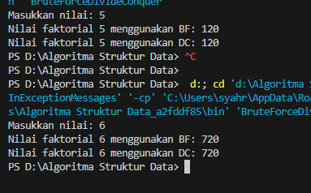
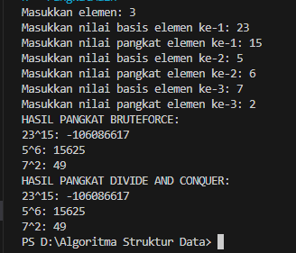
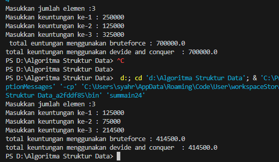
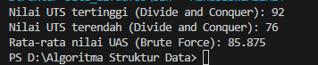

|  | Algoritma dan Struktur Data |
|--|--|
| Nama |  Sahrul Ramadhani|
| NIM |  244107020058|
| Kelas | TI - 1H |

# PRAKTIKUM JOBSHEET 5

### Percobaan 1
Kode Program seperti Jobsheet di implementasikan folder Jobsheet5/Percobaan 1
dan berikut adalah hasil compilenya :  

### Jawaban Percobaan 1
1. Penggunaan IF adalah  sebagai base casenya Jika n == 1, maka langsung mengembalikan 1, Sedangkan Elsenya adalah menjadi pemecahan masalah menjadi sub-masalah yang lebih kecil.
n * faktorialDC(n - 1) akan terus memanggil dirinya sendiri sampai mencapai base case (n == 1).
2. Bisa dengan While Loop, bisa juga dengan Rekursi
3. fakto *= i; digunakan dalam metode iteratif untuk memperbarui nilai dalam loop, sedangkan int fakto = n * faktorialDC(n-1); digunakan untuk menyimpan hasil dari pemanggilan sebelumnya sebelum dikalikan.
4. Brute Force (faktorialBF())	Menggunakan loop (for/while) untuk mengalikan satu per satu dari 1 hingga n, Sedangkan Divide and Conquer (faktorialDC())	Menggunakan rekursi, membagi masalah besar (n!) menjadi sub-masalah ((n-1)!).

### Percobaan 2
Kode Program seperti Jobsheet di implementasikan folder Jobsheet5/Percobaan 2
dan berikut adalah hasil compilenya :  

### Jawaban Percobaan 2
1. Metode pangkatBF() dan pangkatDC() memiliki tujuan yang sama, yaitu menghitung hasil perpangkatan dari suatu bilangan, tapi mereka mempunyai algoritma yang berbeda.
2. Combine sudah termasuk  pada pangkatDC() 
if (n % 2 == 1) { // Jika pangkat ganjil
    return halfPower * halfPower * a; // Combine
} else { // Jika pangkat genap
    return halfPower * halfPower; // Combine
}

3. bisa saja sesuai kebutuhan, dengan kode seperti ini 
int pangkatBF() {
    int hasil = 1;
    for(int i = 0; i < pangkat; i++) {
        hasil *= nilai; 
    }
    return hasil;
}

dan pemanggilan seperti ini :
System.out.println(p.pangkatBF());

4. PangkatBF() menggunakan perulangan for loop sebanyak pangkat kali, setiap iterasi hasil di kalikan nilai. Sedangkan PangkatDC() menggunakan rekursif jika n == 1, langsung return a lalu di bagi jadi 2 bagian ganjil dan genab
Jika n ganjil → Kalikan satu a tambahan
Jika n genap → Hasil langsung dikalikan

### Percobaan 3
Kode Program seperti Jobsheet di implementasikan folder Jobsheet5/Percobaan 3
dan berikut adalah hasil compilenya :  

### Jawaban Percobaan 3
1. variabel mid digunakan untuk membagi array menjadi 2 bagian dalam proses 
rekursi, Nilai mid menentukan titik tengah dari array, sehingga metode totalDC() dapat 
memecah masalah menjadi dua bagian lebih kecil.
2. untuk memecah array menjadi 2 bagian dalam menghitung total keuntungan dari 
masing masing bagian.  
3. Setelah menghitung total keuntungan dari masing-masing bagian (kiri dan 
kanan), perlu menggabungkan hasilnya agar memperoleh total keuntungan keseluruhan. 
4.  if (l == r) {
            return arr [l];
        }
Ketika indeks kiri (l) sama dengan indeks kanan (r), itu berarti hanya ada satu elemen dalam 
subarray, sehingga langsung dikembalikan sebagai hasilnya.
5. Menggunakan devide and conquer untuk menghitung jumlah elemen dalam array. Dengan 
membagi array menjadi 2 bagian.kemudian menghitung masing msing secara rekursif, lalu 
hasilnya dijumlah. Prosess berlajut sampai Base case terjadi saat hanya ada satu elemen, 
sehingga langsung dikembalikan. 

### Tugas Jobsheet 5

Kode Program Tugas telah di implementasikan folder Jobsheet5/Tugas
dan berikut adalah hasil compilenya :  

Kode di atas telah di sesuaikan dengan perintah seperti di jobsheet dengan mengkombinasikan deivde conquer dan brute force untuk menemukan solusi/menentukan:
a. Nilau UTS tertinggi tertinggi menggunakan Divide and Conquer!
b. Nilai UTS terendah menggunakan Divide and Conquer!
c. Rata-rata nilai UAS dari semua mahasiswa menggunakan Brute Force!

