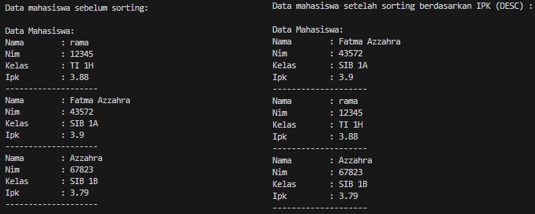

|  | Algoritma dan Struktur Data |
|--|--|
| Nama |  Sahrul Ramadhani|
| NIM |  244107020058|
| Kelas | TI - 1H |

# PRAKTIKUM JOBSHEET 6

### Percobaan 1
Seluruh hasil dari Percobaan 1 Telah di simpan pada Folder Jobsheet6/SC/Sorting
Berikut ini adalah Hasil Screenshoot dari Percobaan 1:

- Dengan Bubble Sort

- Dengan Selection Sort

- Dengan Insertion Sort

### Jawaban Soal Percobaan 1
1. kode tersebut digunakan dalam bubble sort untuk menukar dua elemen dalam array jika tidak dalam urutan yg benar. Kode tersebut digunakan untuk proses mengurutkan elemen array dari yang terkecil ke yang terbesar dengan ascending ataupun sebaliknya.

2. bagian kode dibawah ini merupakan prosses untuk mencari nilai minimun array, setelah menemukan nilai minimum elemen tersebut ditukar dengan elemen di indeks I agar sorting terus berjalan dengan benaar.

3. digunakan untuk mengecek elemen dari kanan ke kiri lalu menggeser elemen yang lebih besar ke kanan agar elemen yang sedang diproses bisa dimasukkan ke posisi yang tepat dalam bagian array yang sudah terurut.

4. digunakan untuk menggeser elemen yang lebih besar ke kanan dengan menyisipkan elemen ke tempat yang benar. Lalu memastikan elemen tetap terurut saat prooses berjalan.

### Percobaan 2
Sorting Menggunakan Array of Object
Hasil Percobaan 2 telah di simpan pada folder Jobsheet6/SC/Mahasiswa
dan berikut adalah hasil Run dari percobaan 2 menggunakan Bubble Sort:

### Jawaban Soal Percobaan 2
1. - Mengapa syarat dari perulangan i adalah i<listMhs.length-1 ?
    Jawaban : karena dalam bubble sort, hanya perlu n-1 iterasi untuk mengurutkan n elemen. Di setiap iterasi, elemen terbesar akan bergeser ke atas ke posisisi yg benar.
   - Mengapa syarat dari perulangan j adalah j<listMhs.length-i ?
    Jawaban : karena digunakan untuk menghindari perbandingan yang tidak perlu karena setiap iterasi sudah menempatkan elemen terbesar ke posisi yang benar
   - Jika banyak data di dalam listMhs adalah 50, maka berapakali perulangan i akan berlangsung? Dan ada    berapa Tahap bubble sort yang ditempuh?
    I < 50 – 1. Maka i akan berulang sebanyak 49 kali.bubble sort akan ditempuk sebanyak 49 kali.

2. Berikut adalah hasil modify yang diperintahkan pada soal.

#### Mengurutkan Data Mahasiswa Berdasarkan IPK (Selection Sort)
Hasil Percobaan tersebut telah di simpan pada folder Jobsheet6/SC/Mahasiswa
dan berikut adalah hasil Run dari percobaan tersebut menggunakan Selection Sort:

#### Mengurutkan Data Mahasiswa Berdasarkan IPK Menggunakan Insertion Sort
Hasil Percobaan tersebut telah di simpan pada folder Jobsheet6/SC/Mahasiswa
dan berikut adalah hasil Run dari percobaan tersebut menggunakan Insertion Sort:

#### Jawaban Pertanyaan
1. untuk mencari nilai minimum dalam array yang belum terurut, idxMin menyimpan indeks terkecil sementara, lalu proses perulangan untuk mencari elemen terkecil yg belum terurut. Lalu jika ditemukan yanng IPK lebih kecil, indeks nya disimpan di idxMin.

#### Mengubah fungsi pada InsertionSort sehingga fungsi tersebut dapat melaksanakan proses sorting dengan cara descending.
Hasil Percobaan tersebut telah di simpan pada folder Jobsheet6/SC/Mahasiswa
dan berikut adalah hasil Run dari percobaan tersebut menggunakan Insertion Sort With Descending:

#### Jawaban Pertanyaan
1. Berikut adalah Screenshoot kode yang di modify menjadi Descending

### TUGAS
Seluruh hasil dari Tugas Telah di simpan pada Folder Jobsheet6/SC/Tugas
Berikut ini adalah Hasil Screenshoot dari Semua Percobaan Tugas:

