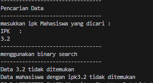

|  | Algoritma dan Struktur Data |
|--|--|
| Nama |  Sahrul Ramadhani|
| NIM |  244107020058|
| Kelas | TI - 1H |

# PRAKTIKUM JOBSHEET 7

### Percobaan 1
#### Searching / Pencarian Menggunakan Agoritma Sequential Search
Hasil Source code dari percobaan 1 telah saya lampirkan pada folder Jobsheet7/SC/Mahasiswa, dan berikut  ini adalah Hasil Outputya :

### Jawaban Pertanyaan Percobaan 1
1. tampilPosisi hanya digunakan untuk menampilkan apakah suatu data (nilai IPK) ditemukan dan pada indeks berapa, sedangkan metode tampilDataSearch menampilkan detail informasi mahasiswa yang memiliki IPK tersebut.
2.	Fungsi break pada kode program di atas adalah untuk menghentikan perulangan (loop) secara paksa ketika kondisi listMhs[j].ipk == cari terpenuhi.

### Percobaan 2
#### Searching / Pencarian Menggunakan Binary Search
asil Source code dari percobaan 2 yaitu Searching / Pencarian Menggunakan Binary Search, telah saya lampirkan pada folder Jobsheet7/SC/Mahasiswa, dan berikut  ini adalah Hasil Outputya :

### Jawaban Pertanyaan Percobaan 2
1. mid = (left + right) / 2; itu adalah proses devide terjadi karena array dibagi 2 bagian menggunakan indeks tengah.
2. Proses conquer itu rekursi yang memanggil dirinya sendiri unutk mencari bagian kanan atau kiri array. Ini dia kodenya : 
    return findBinarySearch(cari, left, mid-1);
    return findBinarySearch(cari, mid+1, right);
3. Tidak, program tidak bisa berjalan dengan benar karena biinary search hanya akan berjalan jika data terurut dengan ascending maupun descending. Jika data tidak urut maka hasil akan salah.
4. 
Tidak bisa, pencarian akan salah karena berbanding terbalik dengan kode program. Pada method findBinarySearch data diurutkan secara ascending bukan descending. Jika ingin mencari dari besar terkecil maka alur kerja program juga harus diubah.
5. Hasil Modify Kode :

### Jawaban Soal Jobsheet 7
a. PencarianDataSequential<no presensi> : digunakan untuk mencari data dosen berdasarkan
nama dengan algoritma sequential search.
b. PencarianDataBinary <no presensi> : digunakan untuk mencari data dosen berdasarkan usia
dengan algoritma Binary Search.
c. Buat aturan untuk mendeteksi hasil pencarian lebih dari 1 hasil dalam bentuk kalimat
peringatan! Pastikan algoritma yang diterapkan sesuai dengan kasus yang diberikan!

Hasil Source code dari percobaan pada Soal Jobsheet 7 telah saya lampirkan pada folder Jobsheet7/SC/Dosen, dan berikut  ini adalah Hasil Outputya :

